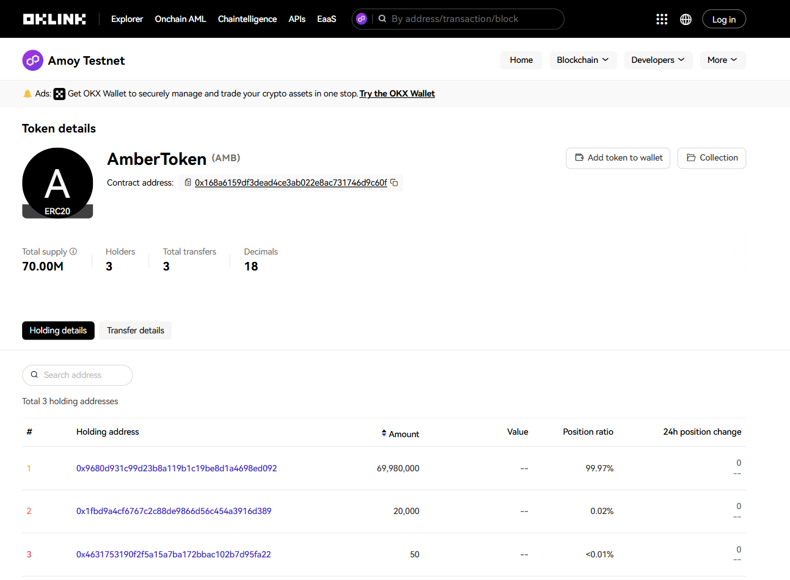
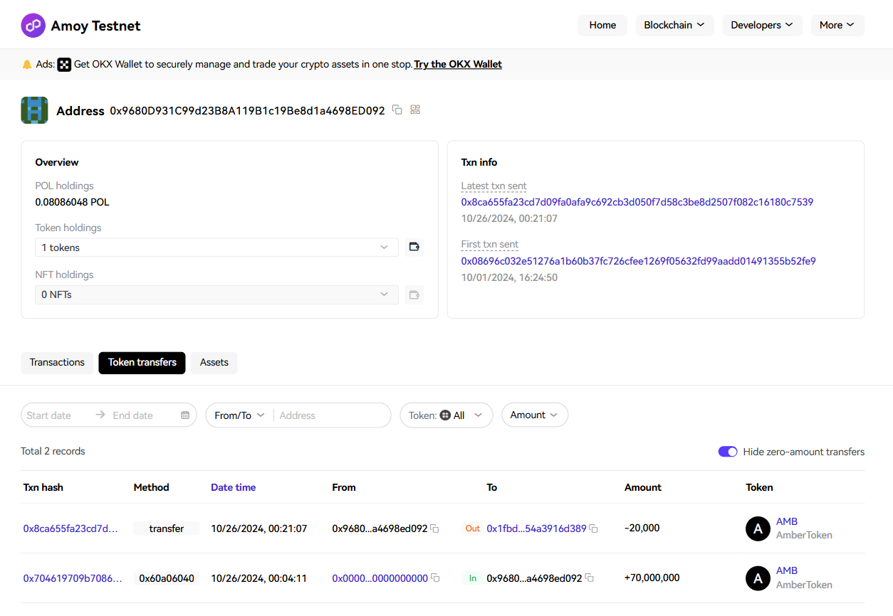

# AmberToken - ERC-20 Token Contract

**AmberToken** is a fungible token implementing the ERC-20 standard with additional functionality like capped supply, burnability, and miner rewards.

## Features of AmberToken (AMB)

1. **Capped Supply (100 MILLION)** : 
   AmberToken uses the `ERC20Capped` extension, limiting the total token supply. The cap is set at deployment and cannot be exceeded, ensuring scarcity.

2. **Burnable**:
   The contract includes `ERC20Burnable`, allowing holders to burn (destroy) tokens, reducing the total supply. This is useful for token management or deflationary mechanics.

3. **Block Rewards**:
   AmberToken implements a block reward feature for miners, which incentivizes miners by minting tokens to the block’s coinbase address.

4. **Owner Privileges**:
   - **Set Block Reward**: The contract owner can adjust the reward amount given to miners per block.
   - **Destroy Contract**: The owner can call `destroy()` to self-destruct the contract, returning any remaining Ether to the owner’s address.

## Use Cases

AmberToken is ideal for applications requiring a limited-supply, fungible asset. The burn and reward mechanisms make it suitable for incentivized and deflationary token economies on blockchain platforms, including those focused on decentralized finance (DeFi) and rewards systems.

## AmberToken Details

## Holder Transactions
Karan Upadhyay : inital 70 million holder

